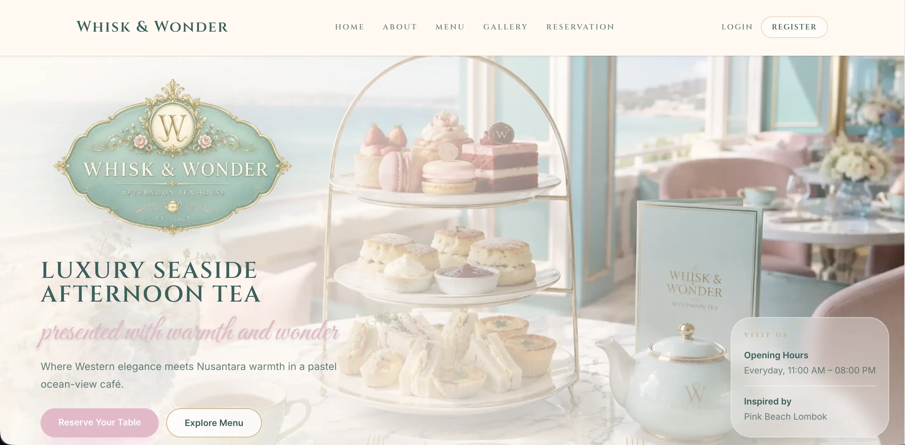
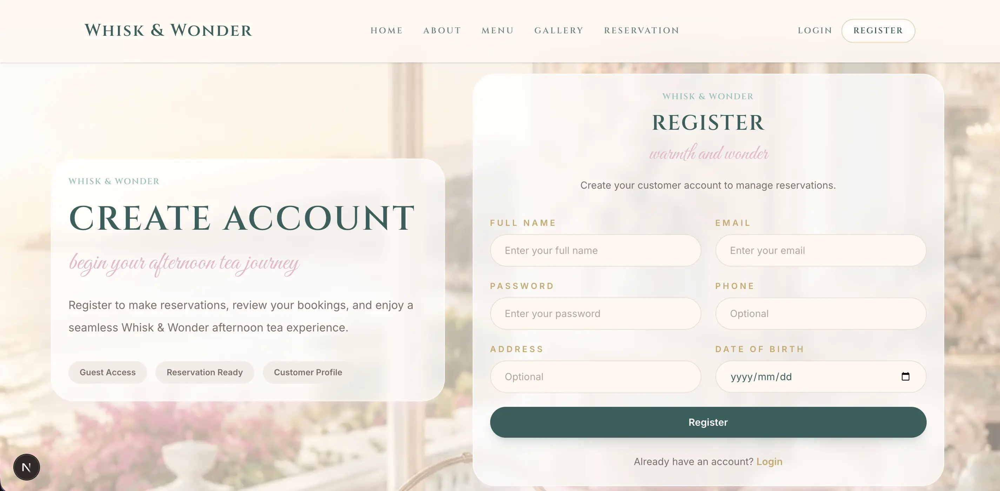
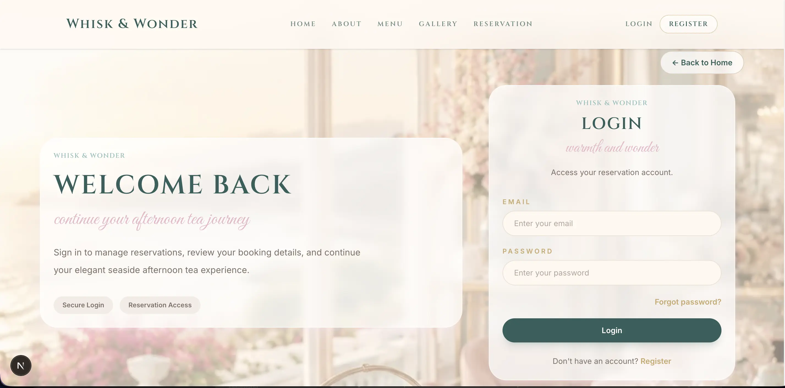
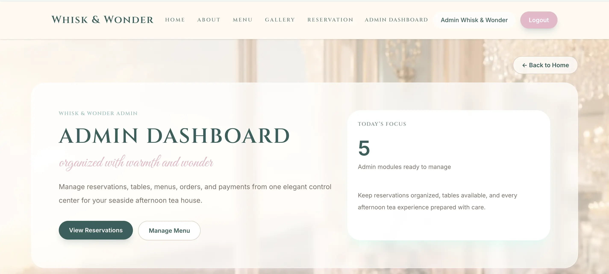
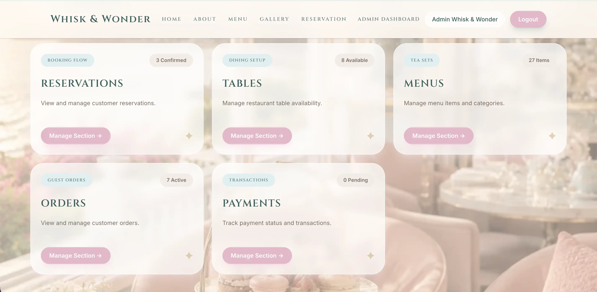
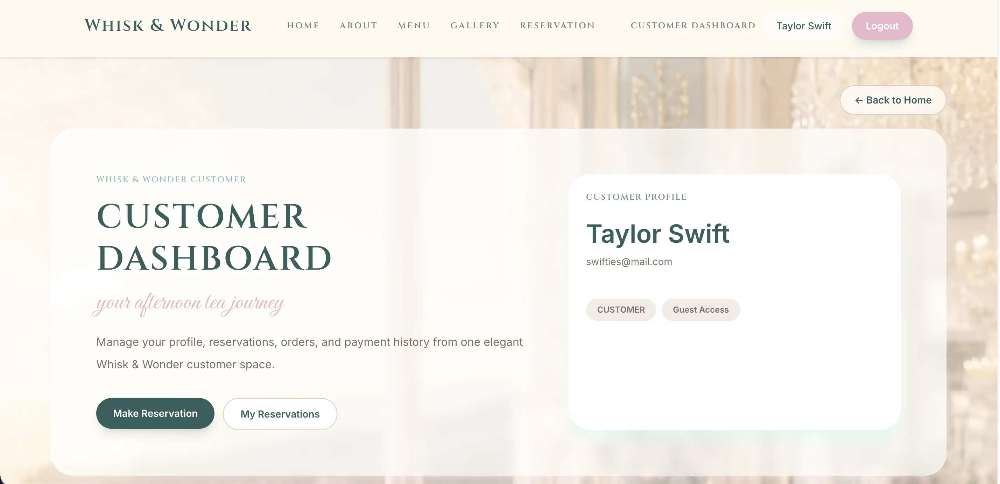
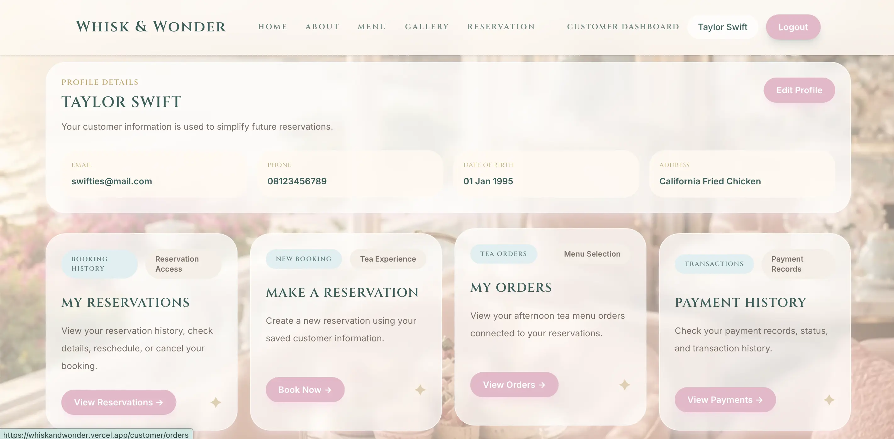
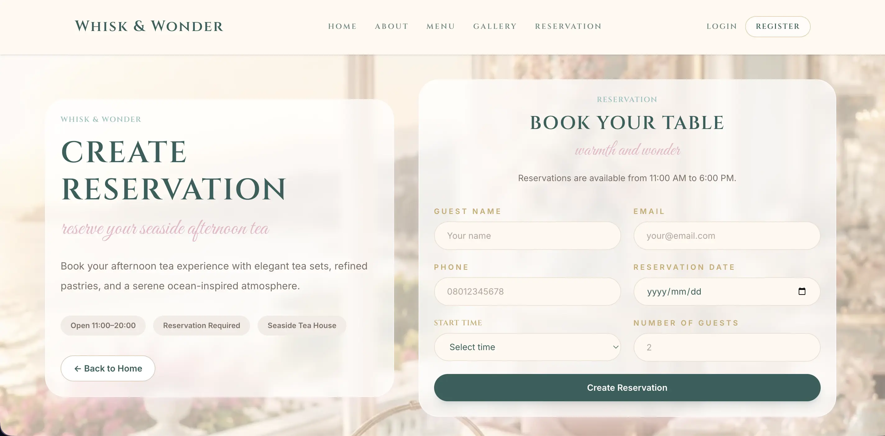

# Whisk & Wonder Frontend

     

A modern luxury afternoon tea reservation platform frontend built with Next.js, TypeScript, Tailwind CSS, and responsive UI architecture.

The frontend connects with the Whisk & Wonder Backend API to provide seamless reservation management, authentication, ordering, and admin dashboard functionality.

---

## Deployment Links

### Live Frontend

- Frontend URL: https://whiskandwonder.vercel.app

### Backend API

- API URL: https://whiskandwonder.up.railway.app
- Swagger Documentation: https://whiskandwonder.up.railway.app/api

### Project Documentation

- Notion Documentation: https://noto.li/jeeuhC

### Presentation

- Canva Presentation: https://canva.link/whisknwonder

---

## Features

### Customer Features

- User Registration & Login
- JWT Authentication
- Afternoon Tea Reservation System
- Reservation Success Page
- Responsive Landing Page
- Menu Browsing
- Protected Customer Dashboard

### Admin Features

- Admin Dashboard
- Reservation Management
- Tables Management
- Menu Management
- Orders Management
- Payments Management
- Search & Filter System

### UI / UX Features

- Responsive Design
- Luxury Café Aesthetic
- Mobile-Friendly Layout
- Protected Routes
- Dynamic Navbar
- Loading States
- Error Handling

---

## Tech Stack

- Next.js 15
- React
- TypeScript
- Tailwind CSS
- JWT Authentication
- REST API Integration
- Vercel Deployment

---

## Project Structure

```txt
app/
├── admin/
│   ├── menus/
│   ├── orders/
│   ├── payments/
│   ├── reservations/
│   ├── tables/
│   └── page.tsx
├── customer/
│   ├── orders/
│   ├── payments/
│   ├── profile/
│   ├── reservations/
│   └── page.tsx
├── forgot-password/
├── login/
├── register/
├── reservation/
│   ├── check/
│   ├── success/
│   └── page.tsx
├── globals.css
├── layout.tsx
└── page.tsx

components/
├── home/
│   ├── AboutPreview.tsx
│   ├── FeatureStrip.tsx
│   ├── Footer.tsx
│   ├── GalleryPreview.tsx
│   ├── HeroSection.tsx
│   ├── MenuPreview.tsx
│   └── ReservationCTA.tsx
├── layout/
│   ├── Navbar.tsx
│   └── ProtectedRoute.tsx
└── ui/
    ├── Button.tsx
    ├── Card.tsx
    ├── Input.tsx
    └── StatusBadge.tsx

hooks/
└── useAuth.ts

lib/
├── api.ts
├── auth.ts
└── reservation.ts

public/
└── images/
    ├── logo.png
    ├── landingpage.webp
    ├── admindashboard.webp
    ├── customerdashboard.webp
    └── guestreservation.webp

types/
└── index.ts

```

---

## Architecture Overview

The frontend follows a modular and scalable architecture.

- App Router → Page routing
- Components Layer → Reusable UI components
- Hooks Layer → Authentication & logic handling
- API Layer → Backend communication
- Protected Routes → JWT-based route protection
- Tailwind CSS → Utility-first styling system

---

## Installation

```bash
npm install
```

---

## Environment Variables

Create `.env.local` file:

```env
NEXT_PUBLIC_API_URL=https://whiskandwonder.up.railway.app
```

---

## Run Application

Development:

```bash
npm run dev
```

Production:

```bash
npm run build
npm run start
```

---

## API Integration

The frontend communicates with the backend REST API using JWT authentication.

Example API connection:

```ts
const response = await fetch(
  "https://whiskandwonder.up.railway.app/reservations",
  {
    credentials: "include",
  },
);
```

---

## Main Pages

| Page                        | Description                   |
| --------------------------- | ----------------------------- |
| /                           | Landing page                  |
| /login                      | User login                    |
| /register                   | User registration             |
| /reservation                | Guest reservation page        |
| /reservation/check          | Check reservation             |
| /reservation/success        | Reservation success page      |
| /customer                   | Customer dashboard            |
| /customer/reservations      | Customer reservations         |
| /customer/reservations/new  | Create reservation with order |
| /customer/reservations/[id] | Reservation detail            |
| /customer/orders            | Customer orders               |
| /customer/payments          | Customer payments             |
| /customer/profile           | Customer profile              |
| /admin                      | Admin dashboard               |
| /admin/reservations         | Reservation management        |
| /admin/reservations/[id]    | Reservation detail management |
| /admin/tables               | Table management              |
| /admin/menus                | Menu management               |
| /admin/orders               | Orders management             |
| /admin/payments             | Payment management            |

---

## UI Design Concept

Whisk & Wonder is designed with a luxury seaside afternoon tea café concept inspired by elegant pastel aesthetics and modern hospitality experiences.

Design characteristics include:

- Soft pastel color palette
- Elegant typography
- Minimalist luxury layout
- Responsive modern interface
- Hospitality-inspired visual hierarchy

---

## Current Status

✅ Authentication System Completed  
✅ Reservation Flow Completed  
✅ Protected Dashboard Completed  
✅ Admin Dashboard Completed  
✅ Customer Dashboard Completed  
✅ Landing Page Completed  
✅ Gallery & About Section Completed  
✅ Responsive Layout Completed  
✅ API Integration Completed  
✅ UI Component System Completed  
✅ Role-Based Authorization Completed  
🚧 Final Bug Fixing & Testing In Progress  
🚧 Presentation & Deployment Refinement In Progress

---

## Future Improvements

- Online Payment Gateway
- Reservation Availability Calendar
- Email Notifications
- Table Availability Visualization
- Advanced Analytics Dashboard
- Dark Mode
- Multi-language Support

---

## Screenshots

### Landing Page



### Register Page



### Login Page



### Admin Dashboard




### Customer Dashboard

## 

## 

### Guest Reservation

## 

## Project Goal

This project demonstrates:

- Frontend architecture using Next.js
- REST API integration
- Authentication flow implementation
- Responsive UI development
- Admin dashboard architecture
- Production-oriented frontend structure
- Modern luxury UI/UX implementation

```

```
